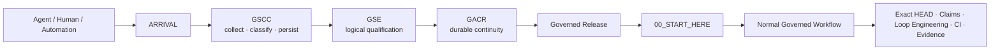
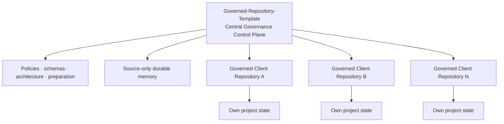
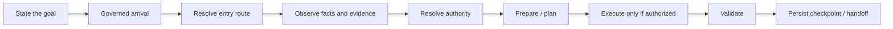

# Governed Repository Template

> **MANDATORY REPOSITORY ENTRY**
>
> Any agent, assistant, automation, connector, GitHub App, API client, or tool surface that reaches this repository MUST treat `/00_GSCC_ENTRY.md` as the first repository authority.
>
> Before planning work, reading `00_START_HERE.md`, selecting a task, or attempting any mutation:
>
> ```text
> ARRIVAL
> → 00_GSCC_ENTRY.md
> → follow only the next authority explicitly emitted by that entry path
> ```
>
> A successful GitHub/API read is only physical access. It is not governed admission.
> No write, branch, commit, issue, PR, dispatch, or governed execution may be selected before the pre-entry path authorizes continuation.

## What is Governed Repository Template?

**Governed Repository Template is an executable governance framework and central control plane for repositories worked on by humans, AI agents, automations, GitHub Apps, API clients and connected infrastructure tools.**

It is designed to make repository work observable, persistent, resumable and authority-aware. An actor that can reach a repository is not automatically admitted to governed work, and an admitted actor is not automatically authorized to mutate it.

The project combines:

- mandatory arrival and First Touch handling;
- GSCC evidence collection and admission gates;
- GSE logical qualification;
- GACR durable continuity across agents and conversations;
- exact-HEAD and collision controls;
- persistent human-readable and machine-readable memory;
- a central multi-repository control plane;
- Loop Engineering and dependency-aware execution;
- governed GitHub/MCP/infrastructure capability boundaries;
- checkpoints, handoffs, CI evidence and execution receipts.

### Architecture in one view



The three pre-entry layers have deliberately different responsibilities:

| Layer | Core question | Responsibility |
| --- | --- | --- |
| **GSCC** | What actually arrived and what evidence is observable? | First Touch, provider/transport facts, classification, admission gates |
| **GSE** | What does this arrival mean logically? | Session interpretation and logical qualification |
| **GACR** | What durable continuity does it belong to? | Correlation, sessions, beacons, chronicles, handoff and recovery |

A physical GitHub/API read is therefore only the beginning:

```text
CAN ACCESS
    ≠
IS ADMITTED
    ≠
IS AUTHORIZED
    ≠
MAY MUTATE
```

### Five governed project routes

The control plane supports five macro workflows:

```text
CREATE_NEW_REPOSITORY
ADOPT_EXISTING_REPOSITORY
MAP_EXISTING_PROJECT
LAB_EVOLUTION
CONTINUE_GOVERNED_WORK
```

They allow the same governance model to cover a fresh repository, additive adoption of an existing project, read-oriented project mapping, isolated lab evolution, and safe continuation of existing governed work.

### Control Plane and client repositories



A central invariant is:

```text
SOURCE CONTROL PLANE MEMORY
!=
DISTRIBUTED TEMPLATE PROJECT STATE
```

The source repository may maintain its own durable control-plane history. Generated or adopted client repositories receive reusable governance structures, not another project's operational history.

### Multi-agent continuity

The framework does not assume that two conversations, agents or provider sessions are the same merely because they access the same repository. Correlation is evidence-driven:

```text
EXACT_IDENTITY
→ STRONG_CORRELATION
→ WEAK_CORRELATION
→ AMBIGUOUS
→ NEW_IDENTITY
```

Missing provider-native facts are represented explicitly, for example as `UNAVAILABLE`; they are never reconstructed from unrelated GitHub metadata.

### How to use the project

The framework is used by starting from the **goal**, not by jumping directly to a script or mutation.

| You want to... | Governed route | Typical outcome |
| --- | --- | --- |
| Create a new project | `CREATE_NEW_REPOSITORY` | New governed repository with an established baseline |
| Bring an existing repository under governance | `ADOPT_EXISTING_REPOSITORY` | Additive governance without replacing existing project history |
| Understand an existing codebase before changing it | `MAP_EXISTING_PROJECT` | Current-state map, target architecture and evidence package |
| Experiment or evolve safely | `LAB_EVOLUTION` | Isolated branch/PR with governed evidence and validation |
| Resume work already in progress | `CONTINUE_GOVERNED_WORK` | Recovery of the canonical checkpoint, task and next action |
| Let another agent continue after interruption | GACR continuation | Correlated durable session, checkpoint and handoff |
| Supply new information without authorizing code changes | Information intake | Persisted evidence, contradiction handling and routing |
| Prepare server/domain/database/MCP work | Governed infrastructure intent | Observed capabilities, plan, authority gates and execution package |
| Coordinate several agents | Multi-agent coordination | Claims, exact-HEAD checks, collision prevention and handoffs |
| Recover after a failed run or stale state | Governed recovery | Reobservation, diagnosis, preserved evidence and safe continuation |

The normal usage pattern is:



For detailed instructions and full use cases, see **[How to use the framework and use-case catalogue](docs/PROJECT_OVERVIEW.md#17-how-to-use-the-framework)**.

### Detailed public architecture

For the full explanation, diagrams, hierarchy, end-to-end arrival example, persistence model, execution lifecycle, source-of-truth hierarchy and repository map, read:

**[docs/PROJECT_OVERVIEW.md](docs/PROJECT_OVERVIEW.md)**

> Human discovery can start with this README and the project overview. Agents and automations must still follow the mandatory governed entry beginning at `00_GSCC_ENTRY.md`.

---

Template générique de gouvernance pour les dépôts de l'organisation `chainsolutions-wealthtech`.

## Objectif

Fournir dès la création d'un dépôt :
- un point d'entrée obligatoire ;
- une gouvernance explicite et machine-readable ;
- une mémoire projet persistante ;
- le Loop Engineering ;
- une discipline de non-régression ;
- une hiérarchie de sources de vérité ;
- un état courant, un historique, un TODO et une prochaine action uniques ;
- un handoff inter-agent ;
- des décisions ADR ;
- une CI de gouvernance ;
- un bootstrap déterministe.

Ce template transporte des **règles et des structures**, jamais l'historique d'un autre projet.

## Première utilisation

Après création d'un dépôt depuis ce template :

```bash
python3 scripts/initialize_governance.py --repository "chainsolutions-wealthtech/mon-projet" --project-name "Mon Projet" --project-type "application" --owner "@owner"
```

Puis compléter `PROJECT_CONTEXT.md`, `docs/ARCHITECTURE.md`, `ACCEPTANCE_CRITERIA.md` et `NEXT_ACTION.md`.

Le dépôt créé devient sa propre source de vérité. Le template ne doit jamais injecter une décision métier, une source réglementaire, un statut de production ou un historique appartenant à un autre projet.

<!-- GOVERNANCE_AUTOMATION_V2 -->
## Automatic initialization

The template includes `.github/workflows/governance-auto-bootstrap.yml`.

When started by a supported GitHub event in an instantiated repository, it automatically infers repository metadata, initializes governance, validates it, creates a bootstrap receipt and attests the initialization. Manual commands remain available as a deterministic recovery path.

## Multi-agent continuity

The repository includes a Git-only coordination layer:

- canonical-memory pointer and monotone revisions;
- exact-HEAD guard;
- agent sessions without invented provider identifiers;
- dependency/collision-safe work dispatch;
- structured checkpoints and handoff;
- new-information intake with contradiction hold-for-review.

See `docs/AUTOMATION.md`, `docs/MULTI_AGENT_COORDINATION.md` and `docs/INFORMATION_INTAKE.md`.


## Capability intent layer — V2.1

The template now separates governance from technical and infrastructure intent.

A newly created repository receives:

- `.governance/project-profile.json`: profile discovery and the optional `chainsolutions-fullstack-web` candidate;
- `.governance/infrastructure-intent.json`: server/domain/directory/database/MCP/SSH lifecycle, including resources that do not yet exist;
- `.governance/connection-intent-policy.json`: deterministic routing for agent connections.

The Chainsolutions full-stack candidate plans Node.js, Next.js + TypeScript and PostgreSQL without claiming that any of them are implemented or deployed.

Direct governed MCP access is the preferred server transport. SSH is a governed fallback. Secrets and credentials are never stored in repository governance.

A session intent is not an authorization. Context or information intake never grants code permission, and `UNKNOWN` fails closed for mutable dispatch.

See `docs/PROJECT_PROFILES.md`, `docs/INFRASTRUCTURE_BOOTSTRAP.md` and `docs/CONNECTION_INTENT.md`.


## V2.2 entry workflow layer

Every agent connection now resolves a macro entry action before mutable dispatch:

1. create a new repository;
2. adopt an existing repository additively;
3. map an existing project and/or design a target architecture;
4. evolve an existing project through an isolated lab branch or PR;
5. continue normal governed work.

The template supports organization and explicitly targeted personal-account repository scopes. Existing-project adoption is plan-first and preserves pre-existing project files by default.


## Central Governed Control Plane — V2.3

The template repository now acts as the central preparation/control plane for governed GitHub work.

Start a `[Governed Request]` issue on `chainsolutions-wealthtech/Governed-Repository-Template`. The control plane will:

1. resolve the macro entry action;
2. resolve connection intent;
3. identify/observe the target;
4. resolve owner scope and authority;
5. build a chronological preparatory execution package;
6. request one action/evidence item at a time;
7. stop on contradiction, denied authority or failed evidence;
8. emit an explicit `HANDOFF_READY` package before normal target work begins.

Generated/adopted repositories keep the central control-plane reference but are clients, not duplicate control planes.

## V2.6 governed repository connectivity

The current governed creation path includes:

- V2.6.0 — GitHub OIDC-issued ephemeral SSH certificates for read-only fallback;
- V2.6.1 — central-to-local GitHub App machine command transport;
- V2.6.2 — complete packaging of the machine-command target upgrader;
- V2.6.3 — automatic provisioning of the existing direct MCP Actions credential from the central control plane into a target repository under an exact-HEAD credential gate.

A newly governed repository therefore does not require a persistent SSH private key and, once the central control plane is configured, does not require the owner to manually copy the direct MCP token into each target repository.

Credential provisioning does not grant server WRITE authority. MCP project registration, scoped-write gates and explicit mutation approval remain separate controls.

## Source repository self-governance — V2.7

The template source is itself governed without converting distributed project-state templates into source history.

When `.template-source` exists:
- human source state lives under `docs/control-plane/`;
- machine checkpoint/handoff/task projections live under `.governance/control-plane-state/`;
- those paths are `SOURCE_ONLY`;
- client initialization removes them;
- Governance CI verifies both source completeness and client non-leakage.

This enables exact conversation/agent continuity through versioned Git state while preserving a clean generic template for newly generated repositories.

