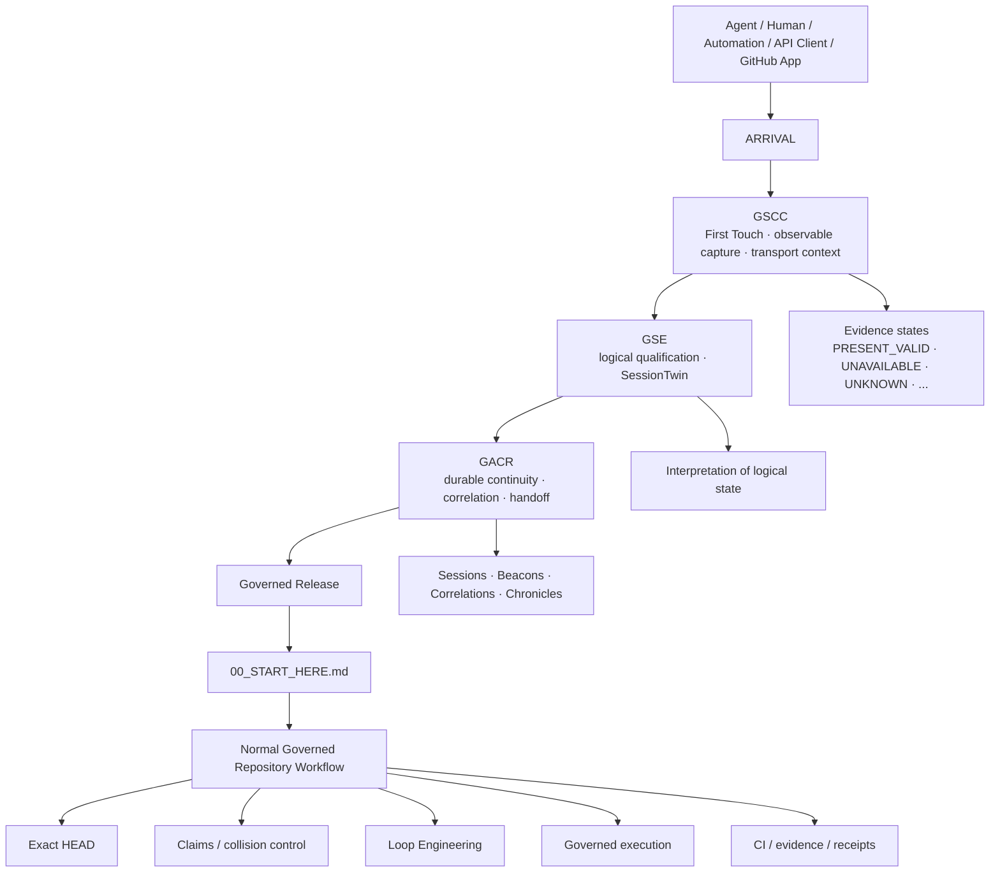
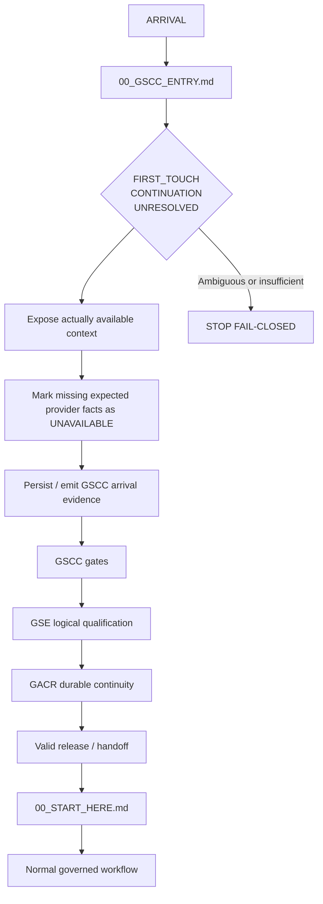
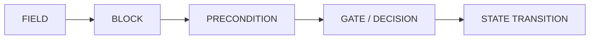
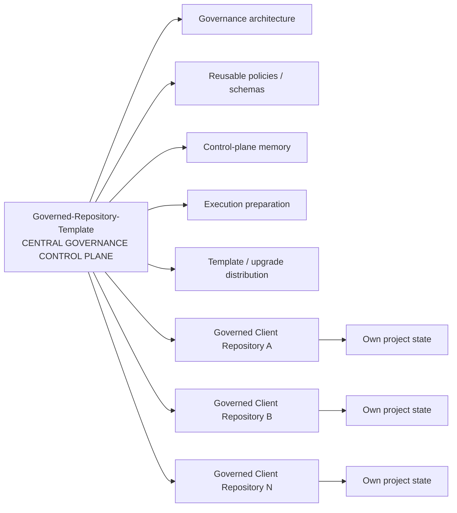
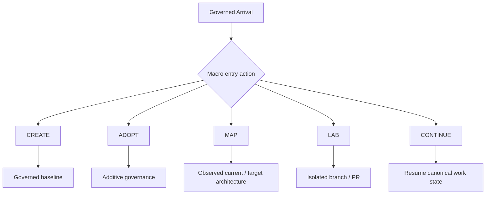
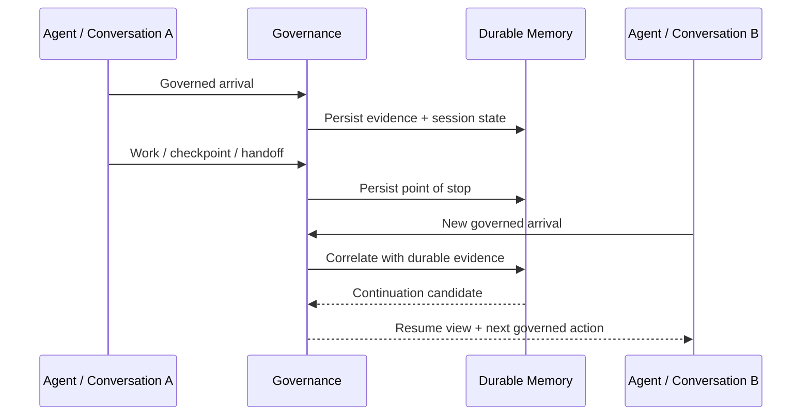
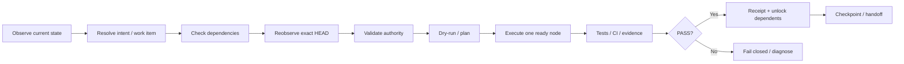
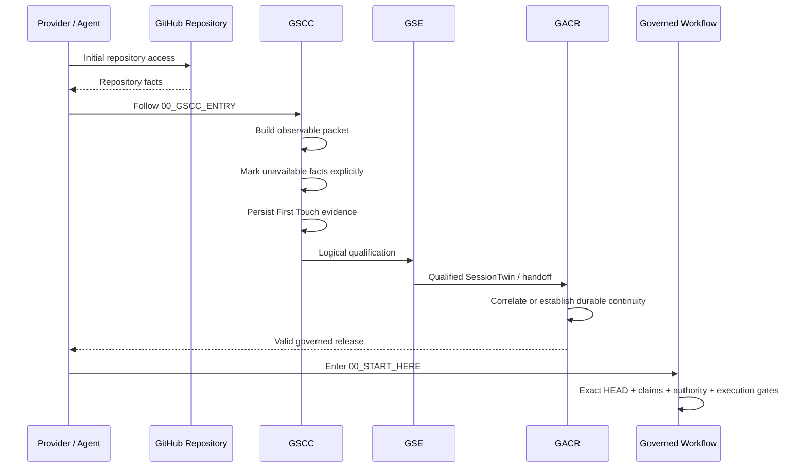
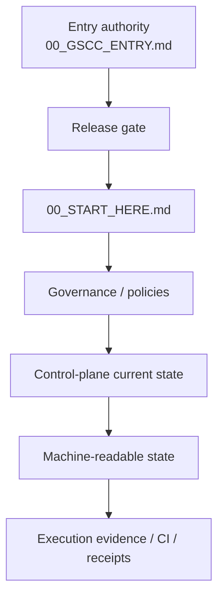

# Governed Repository Template — Project Overview

> Public presentation of the architecture, purpose, operating model and governed lifecycle.
>
> This document is explanatory. It does not replace the normative entry authorities. Any agent, assistant, automation, connector, GitHub App, API client or tool surface entering the repository MUST begin with `/00_GSCC_ENTRY.md`.

## 1. What this project is

**Governed Repository Template is an executable governance framework and central control plane for repositories worked on by humans, AI agents, automations and connected tools.**

Its purpose is not merely to provide Markdown conventions or a starter folder structure. It establishes a governed operating system around repository work so that an arriving actor does not silently act from stale context, invented identity, implicit authority or an unverified repository state.

The framework is designed to make work:

- observable before it becomes mutable;
- attributable to the evidence that actually exists;
- resumable across agents and conversations;
- exact-HEAD aware;
- fail-closed when identity, authority, evidence or state is ambiguous;
- persistent across interruptions;
- compatible with multiple repositories, providers and execution surfaces;
- auditable through durable checkpoints, handoffs, decisions and receipts;
- additive to existing projects rather than destructive by default.

The source repository itself also acts as the **Central Governance Control Plane**. Repositories created from or adopted by the framework are governed clients; they do not receive the source control plane's private working history.

---

## 2. The problem it solves

Modern repository work can involve developers, assistants, autonomous agents, GitHub Apps, CI jobs, API clients and infrastructure connectors. Without a shared governance layer, several failure modes become likely:

| Risk | Governed response |
| --- | --- |
| An agent arrives with incomplete context | Mandatory pre-entry and evidence classification |
| A conversation is interrupted | Persistent checkpoints and GACR continuity |
| Two agents act on the same mutable surface | Claims, collision controls and exact-HEAD checks |
| A provider does not expose a session identifier | Record `UNAVAILABLE`; never invent one |
| Repository access is mistaken for authorization | Physical access and governed admission are separated |
| A stale branch or HEAD is used | Reobserve canonical HEAD before mutation |
| Decisions disappear in chat history | Canonical state, decisions, handoffs and relational memory |
| A task is repeated by a later agent | Durable work state and continuation routing |
| Infrastructure changes are attempted without proof | Preflight, authority, dry-run, evidence and rollback gates |
| Capabilities are assumed rather than observed | Capability catalogue and fail-closed execution gates |

The design principle is simple:

```text
CAN ACCESS
    ≠
IS ADMITTED
    ≠
IS AUTHORIZED
    ≠
MAY MUTATE
```

---

## 3. Architecture at a glance



The architecture separates three concerns that must not be collapsed into one another:

### GSCC — arrival, collection and First Touch

GSCC answers:

> **Who or what has arrived, through which observable surface, and what facts are actually available?**

It collects only information genuinely exposed by the runtime, connector, provider or repository surface. Expected facts that are not exposed are explicitly represented as `UNAVAILABLE`.

### GSE — logical state interpretation

GSE answers:

> **What does this arrival mean in the current governed context?**

It performs logical qualification and establishes the appropriate session interpretation without prematurely turning uncertain evidence into durable identity.

### GACR — durable continuity

GACR answers:

> **To which durable governed continuity does this arrival belong, and how can work safely resume?**

It manages correlations, persistent sessions, handoffs, beacons, chronicles and resumption safeguards.

---

## 4. Canonical governed entry

The repository's mandatory pre-entry sequence is:



A successful GitHub call such as `get_repo` or `fetch_file` proves only that the repository can be reached. It does **not** prove governed admission.

The detailed gate order is currently represented as:

```text
First Touch
→ GSCC
→ Q1
→ Q3
→ Q4
→ Q5
→ Q8
→ Q9
→ Q10 / GSE initial logical SessionTwin
→ Q2 / GACR durable binding
→ Q6 / Q7
→ Q11 / Q12
→ F1
→ governed workflow
```

The gate ordering exists to preserve the separation between collection, logical qualification, durable binding and capability exposure.

---

## 5. Evidence is explicit, not guessed

Every expected evidence field is accounted for using a controlled vocabulary:

```text
PRESENT_VALID
PRESENT_INVALID
UNAVAILABLE
UNKNOWN
STALE
CONTRADICTORY
NOT_APPLICABLE
OPTIONAL_MISSING
```

This prevents a common failure mode in agent systems: turning absence of data into an invented identity or inferred authorization.

The progression model is:



No provider-private conversation, session, installation, connection or client identifier may be fabricated from unrelated GitHub metadata.

---

## 6. Control Plane versus governed client repositories

The source repository has two distinct responsibilities:



A core invariant is:

```text
SOURCE CONTROL PLANE MEMORY
!=
DISTRIBUTED TEMPLATE PROJECT STATE
```

The template distributes governance structures and reusable machinery. It must not leak the source control plane's project history, private operational state or another project's business decisions into a client repository.

---

## 7. Five macro workflows

The framework supports five major ways of entering governed project work.

| Workflow | Purpose | Default posture |
| --- | --- | --- |
| `CREATE_NEW_REPOSITORY` | Create a new governed repository and establish its baseline | Plan, qualify, materialize, validate |
| `ADOPT_EXISTING_REPOSITORY` | Add governance to an existing repository without overwriting its history | Additive and preservation-first |
| `MAP_EXISTING_PROJECT` | Observe and map an existing project or target architecture | Read-only by default |
| `LAB_EVOLUTION` | Explore or implement an evolution in an isolated branch/PR | Isolated mutable path |
| `CONTINUE_GOVERNED_WORK` | Resume an already governed project from durable state | Continuity-first |



Connection intent, macro entry action and execution authority remain separate concepts. Selecting a route does not itself authorize a mutation.

---

## 8. Multi-agent continuity

The framework is designed for situations where multiple agents or conversations may arrive over time.

Two arrivals are not assumed to represent the same session merely because they use the same repository or GitHub actor.

Correlation follows evidence strength rather than intuition:

```text
EXACT_IDENTITY
→ STRONG_CORRELATION
→ WEAK_CORRELATION
→ AMBIGUOUS
→ NEW_IDENTITY
```

Ambiguity fails closed.

The durable continuity layer can maintain:

- First Touch evidence;
- logical sessions;
- durable GACR sessions;
- beacons;
- correlations;
- conversation chronicles;
- handoffs;
- checkpoints;
- activity records;
- interruption and recovery evidence.



The goal is not to make conversations identical. It is to preserve enough durable evidence for each distinct arrival to be correctly classified and, when justified, resumed into the correct governed continuity.

---

## 9. Persistent memory and state

The control plane maintains both human-readable and machine-readable state.

Human-readable source state lives primarily under:

```text
docs/control-plane/
```

Machine-readable projections live primarily under:

```text
.governance/control-plane-state/
```

The relational memory model supports concepts such as:

```text
cases
phases
questions
activities
decisions
runs
evidence
checkpoints
handoffs
owner feedback
intakes
artifacts
```

The objective is to make important governance facts queryable, versioned and resumable rather than dependent on transient chat history.

---

## 10. Loop Engineering and governed execution

Once an arrival has been released into normal governed work, execution remains constrained.

A simplified lifecycle is:



Important execution principles include:

- dry-run before side effects where applicable;
- exact target HEAD before repository-scoped mutation;
- one ready dependency node at a time;
- no silent capability widening;
- explicit blocking when a required capability is missing;
- execution receipts that never contain secret values;
- persistence of evidence needed for the next actor to continue safely.

---

## 11. Capability and infrastructure boundaries

The framework can model GitHub, MCP, server and infrastructure capabilities, but capability does not equal authority.

```text
OBSERVED CAPABILITY
        ↓
CURRENT CONTRACT
        ↓
POLICY / SCOPE CHECK
        ↓
AUTHORITY GATE
        ↓
EXECUTION PLAN
        ↓
MUTATION
```

The separate `Patricked-code/MCP` project remains independently governed. This repository may observe its capabilities or create governed intake items when integration needs are discovered; that does not make the Template repository the source of truth for MCP implementation.

Secrets, tokens, private keys and equivalent credential values are not governance state and must not be persisted into repository documentation or execution receipts.

---

## 12. A complete arrival example

Consider a fresh assistant conversation connecting to the repository.



If the runtime does not expose a native provider conversation identifier, the correct value is `UNAVAILABLE`. The system must not synthesize one from the GitHub actor, repository name, branch, commit SHA or URL.

---

## 13. Repository hierarchy

A conceptual map of the most important public surfaces:

```text
Governed-Repository-Template/
│
├── 00_GSCC_ENTRY.md
│   └── mandatory pre-entry authority
│
├── 00_START_HERE.md
│   └── normal governed-work entry after valid release
│
├── GOVERNANCE.md
├── AGENTS.md
├── SOURCE_OF_TRUTH.md
├── PROJECT_CONTEXT.md
├── STATUS.md
├── SUIVI.md
├── TODO.md
├── NEXT_ACTION.md
│
├── docs/
│   ├── PROJECT_OVERVIEW.md
│   ├── ARCHITECTURE.md
│   ├── AUTOMATION.md
│   ├── MULTI_AGENT_COORDINATION.md
│   ├── INFORMATION_INTAKE.md
│   ├── CONNECTION_INTENT.md
│   ├── ENTRY_ACTION_ROUTER.md
│   ├── GACR_AGENT_CONTINUITY_RELAY.md
│   ├── GACR_BRIDGE_CONTRACT.md
│   └── control-plane/
│       ├── CURRENT_STATE.md
│       ├── CANONICAL_ARCHITECTURE.md
│       ├── PROGRAM.md
│       ├── TASKS.md
│       ├── NEXT_ACTION.md
│       ├── DECISIONS_LOG.md
│       ├── SUIVI.md
│       ├── DATA_MODEL.md
│       └── AGENT_ACTIVITY_LOG.md
│
├── .governance/
│   ├── control-plane-state/
│   ├── control-plane-db/
│   ├── agent-relay/
│   └── machine-readable policies / routers / state
│
├── .github/
│   └── governed workflows and CI
│
└── scripts/
    └── deterministic governance and execution helpers
```

Not every file is an authority for every context. The mandatory entry and read-order rules determine which source applies first.

---

## 14. Source of truth hierarchy

The framework intentionally separates explanatory documentation from normative and current-state authorities.

A useful reading model is:



This `PROJECT_OVERVIEW.md` file is a **presentation and navigation document**. Where it conflicts with a normative authority or a machine-readable current-state contract, the canonical authority wins.

---

## 15. Current maturity model

The repository has evolved beyond a static template. Its major architectural layers now include:

```text
GOVERNED REPOSITORY PLATFORM
│
├── Admission & First Touch
│   └── GSCC
│
├── Logical qualification
│   └── GSE
│
├── Durable continuity
│   └── GACR
│
├── Central Governance Control Plane
│
├── Machine-readable governance state
│
├── Relational memory / SQLite projections
│
├── Governance Model Catalogue
│
├── Multi-agent coordination
│
├── Loop Engineering
│
├── Governed Execution Engine
│
├── GitHub integration
│
├── MCP capability integration boundary
│
└── Governed client repositories
```

Some capabilities may be structurally implemented and CI-tested before they are proven live across every external provider surface. Current-state authorities and checkpoints must be consulted for the exact maturity of any specific gate or integration.

---

## 16. How to read the repository

### If you are an arriving agent or automation

Do **not** start with this overview.

Start with:

1. `00_GSCC_ENTRY.md`
2. follow only the next authority emitted by that path;
3. enter `00_START_HERE.md` only after valid GSCC → GSE → GACR release.

### If you are a human discovering the project

Recommended conceptual path:

1. `README.md`
2. `docs/PROJECT_OVERVIEW.md`
3. `docs/control-plane/CANONICAL_ARCHITECTURE.md`
4. `docs/MULTI_AGENT_COORDINATION.md`
5. `docs/GACR_AGENT_CONTINUITY_RELAY.md`
6. `docs/control-plane/DATA_MODEL.md`
7. `docs/control-plane/CURRENT_STATE.md`

### If you need the current execution status

Read the source-only control-plane authorities, especially:

- `docs/control-plane/CURRENT_STATE.md`
- `docs/control-plane/PROGRAM.md`
- `docs/control-plane/TASKS.md`
- `docs/control-plane/NEXT_ACTION.md`
- `.governance/control-plane-state/checkpoint.json`
- `.governance/control-plane-state/handoff.json`

---

## 17. Core invariants

The project can be understood through a small set of invariants:

```text
Physical access != governed admission
Capability != authority
Intent != authorization
Provider data must not be invented
Ambiguous identity fails closed
GSE qualification precedes durable GACR binding
Exact HEAD precedes mutation
Persistent evidence precedes safe continuation
One repository's history must not leak into another
Control-plane memory != distributed client state
PASS evidence unlocks dependents
A blocked capability is not silently skipped
```

These invariants are more important than any individual implementation detail. They define the safety and continuity model the rest of the repository exists to enforce.

---

## 18. In one sentence

**Governed Repository Template turns repository access into a controlled, evidence-backed, persistent and resumable workflow so that humans and AI agents can collaborate across conversations, tools and repositories without losing state, inventing authority or silently bypassing governance.**
