# Governed Repository Template — Project Overview

> Public presentation of the architecture, purpose, operating model and governed lifecycle.
>
> This document is explanatory. It does not replace the normative entry authorities. Any agent, assistant, automation, connector, GitHub App, API client or tool surface entering the repository MUST begin with `/00_GSCC_ENTRY.md`.

## 1. What this project is

**Governed Repository Template is an executable governance framework and central control plane for repositories worked on by humans, AI agents, automations and connected tools.**

Its purpose is not merely to provide Markdown conventions or a starter folder structure. It establishes a governed operating system around repository work so that an arriving actor does not silently act from stale context, invented identity, implicit authority or an unverified repository state.

The framework is designed to make work:

- observable before it becomes mutable;
- attributable to the evidence that actually exists;
- resumable across agents and conversations;
- exact-HEAD aware;
- fail-closed when identity, authority, evidence or state is ambiguous;
- persistent across interruptions;
- compatible with multiple repositories, providers and execution surfaces;
- auditable through durable checkpoints, handoffs, decisions and receipts;
- additive to existing projects rather than destructive by default.

The source repository itself also acts as the **Central Governance Control Plane**. Repositories created from or adopted by the framework are governed clients; they do not receive the source control plane's private working history.

---

## 2. The problem it solves

Modern repository work can involve developers, assistants, autonomous agents, GitHub Apps, CI jobs, API clients and infrastructure connectors. Without a shared governance layer, several failure modes become likely:

| Risk | Governed response |
| --- | --- |
| An agent arrives with incomplete context | Mandatory pre-entry and evidence classification |
| A conversation is interrupted | Persistent checkpoints and GACR continuity |
| Two agents act on the same mutable surface | Claims, collision controls and exact-HEAD checks |
| A provider does not expose a session identifier | Record `UNAVAILABLE`; never invent one |
| Repository access is mistaken for authorization | Physical access and governed admission are separated |
| A stale branch or HEAD is used | Reobserve canonical HEAD before mutation |
| Decisions disappear in chat history | Canonical state, decisions, handoffs and relational memory |
| A task is repeated by a later agent | Durable work state and continuation routing |
| Infrastructure changes are attempted without proof | Preflight, authority, dry-run, evidence and rollback gates |
| Capabilities are assumed rather than observed | Capability catalogue and fail-closed execution gates |

The design principle is simple:

```text
CAN ACCESS
    ≠
IS ADMITTED
    ≠
IS AUTHORIZED
    ≠
MAY MUTATE
```

---

## 3. Architecture at a glance

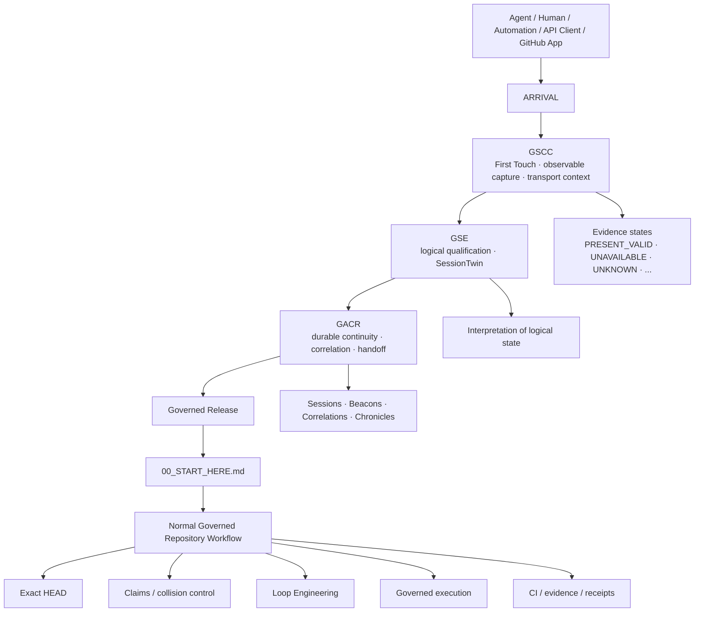

The architecture separates three concerns that must not be collapsed into one another:

### GSCC — arrival, collection and First Touch

GSCC answers:

> **Who or what has arrived, through which observable surface, and what facts are actually available?**

It collects only information genuinely exposed by the runtime, connector, provider or repository surface. Expected facts that are not exposed are explicitly represented as `UNAVAILABLE`.

### GSE — logical state interpretation

GSE answers:

> **What does this arrival mean in the current governed context?**

It performs logical qualification and establishes the appropriate session interpretation without prematurely turning uncertain evidence into durable identity.

### GACR — durable continuity

GACR answers:

> **To which durable governed continuity does this arrival belong, and how can work safely resume?**

It manages correlations, persistent sessions, handoffs, beacons, chronicles and resumption safeguards.

---

## 4. Canonical governed entry

The repository's mandatory pre-entry sequence is:

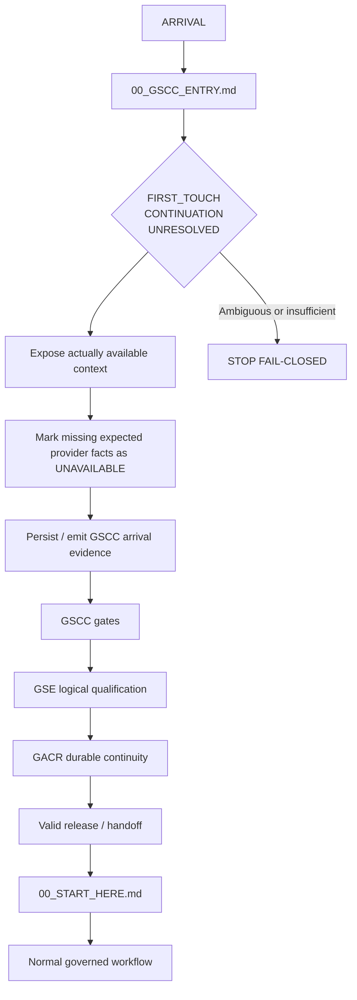

A successful GitHub call such as `get_repo` or `fetch_file` proves only that the repository can be reached. It does **not** prove governed admission.

The detailed gate order is currently represented as:

```text
First Touch
→ GSCC
→ Q1
→ Q3
→ Q4
→ Q5
→ Q8
→ Q9
→ Q10 / GSE initial logical SessionTwin
→ Q2 / GACR durable binding
→ Q6 / Q7
→ Q11 / Q12
→ F1
→ governed workflow
```

The gate ordering exists to preserve the separation between collection, logical qualification, durable binding and capability exposure.

---

## 5. Evidence is explicit, not guessed

Every expected evidence field is accounted for using a controlled vocabulary:

```text
PRESENT_VALID
PRESENT_INVALID
UNAVAILABLE
UNKNOWN
STALE
CONTRADICTORY
NOT_APPLICABLE
OPTIONAL_MISSING
```

This prevents a common failure mode in agent systems: turning absence of data into an invented identity or inferred authorization.

The progression model is:

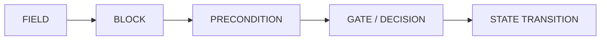

No provider-private conversation, session, installation, connection or client identifier may be fabricated from unrelated GitHub metadata.

---

## 6. Control Plane versus governed client repositories

The source repository has two distinct responsibilities:

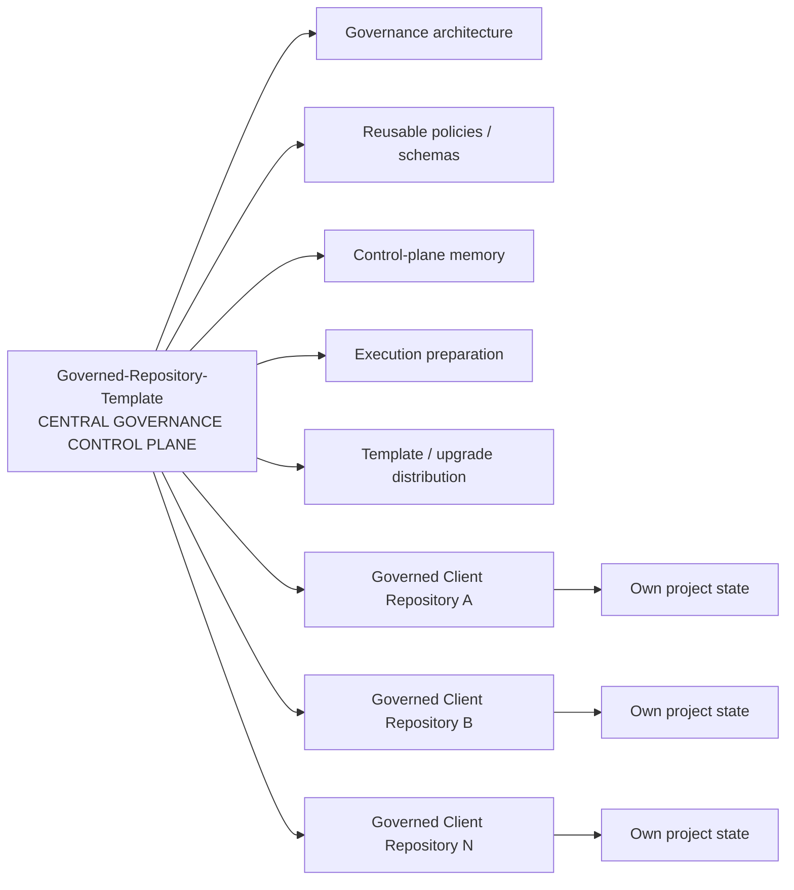

A core invariant is:

```text
SOURCE CONTROL PLANE MEMORY
!=
DISTRIBUTED TEMPLATE PROJECT STATE
```

The template distributes governance structures and reusable machinery. It must not leak the source control plane's project history, private operational state or another project's business decisions into a client repository.

---

## 7. Five macro workflows

The framework supports five major ways of entering governed project work.

| Workflow | Purpose | Default posture |
| --- | --- | --- |
| `CREATE_NEW_REPOSITORY` | Create a new governed repository and establish its baseline | Plan, qualify, materialize, validate |
| `ADOPT_EXISTING_REPOSITORY` | Add governance to an existing repository without overwriting its history | Additive and preservation-first |
| `MAP_EXISTING_PROJECT` | Observe and map an existing project or target architecture | Read-only by default |
| `LAB_EVOLUTION` | Explore or implement an evolution in an isolated branch/PR | Isolated mutable path |
| `CONTINUE_GOVERNED_WORK` | Resume an already governed project from durable state | Continuity-first |

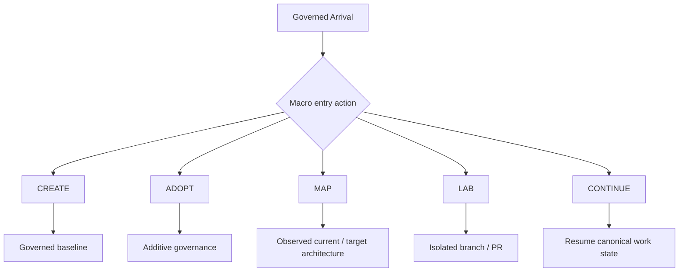

Connection intent, macro entry action and execution authority remain separate concepts. Selecting a route does not itself authorize a mutation.

---

## 8. Multi-agent continuity

The framework is designed for situations where multiple agents or conversations may arrive over time.

Two arrivals are not assumed to represent the same session merely because they use the same repository or GitHub actor.

Correlation follows evidence strength rather than intuition:

```text
EXACT_IDENTITY
→ STRONG_CORRELATION
→ WEAK_CORRELATION
→ AMBIGUOUS
→ NEW_IDENTITY
```

Ambiguity fails closed.

The durable continuity layer can maintain:

- First Touch evidence;
- logical sessions;
- durable GACR sessions;
- beacons;
- correlations;
- conversation chronicles;
- handoffs;
- checkpoints;
- activity records;
- interruption and recovery evidence.

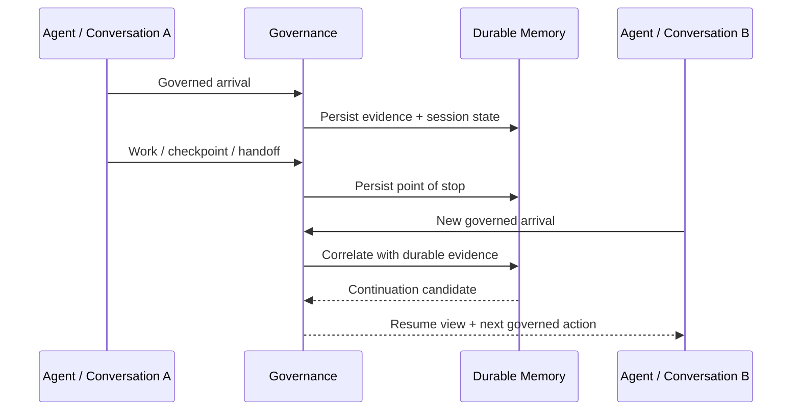

The goal is not to make conversations identical. It is to preserve enough durable evidence for each distinct arrival to be correctly classified and, when justified, resumed into the correct governed continuity.

---

## 9. Persistent memory and state

The control plane maintains both human-readable and machine-readable state.

Human-readable source state lives primarily under:

```text
docs/control-plane/
```

Machine-readable projections live primarily under:

```text
.governance/control-plane-state/
```

The relational memory model supports concepts such as:

```text
cases
phases
questions
activities
decisions
runs
evidence
checkpoints
handoffs
owner feedback
intakes
artifacts
```

The objective is to make important governance facts queryable, versioned and resumable rather than dependent on transient chat history.

---

## 10. Loop Engineering and governed execution

Once an arrival has been released into normal governed work, execution remains constrained.

A simplified lifecycle is:

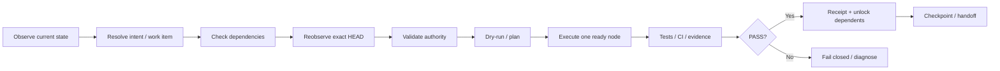

Important execution principles include:

- dry-run before side effects where applicable;
- exact target HEAD before repository-scoped mutation;
- one ready dependency node at a time;
- no silent capability widening;
- explicit blocking when a required capability is missing;
- execution receipts that never contain secret values;
- persistence of evidence needed for the next actor to continue safely.

---

## 11. Capability and infrastructure boundaries

The framework can model GitHub, MCP, server and infrastructure capabilities, but capability does not equal authority.

```text
OBSERVED CAPABILITY
        ↓
CURRENT CONTRACT
        ↓
POLICY / SCOPE CHECK
        ↓
AUTHORITY GATE
        ↓
EXECUTION PLAN
        ↓
MUTATION
```

The separate `Patricked-code/MCP` project remains independently governed. This repository may observe its capabilities or create governed intake items when integration needs are discovered; that does not make the Template repository the source of truth for MCP implementation.

Secrets, tokens, private keys and equivalent credential values are not governance state and must not be persisted into repository documentation or execution receipts.

---

## 12. A complete arrival example

Consider a fresh assistant conversation connecting to the repository.

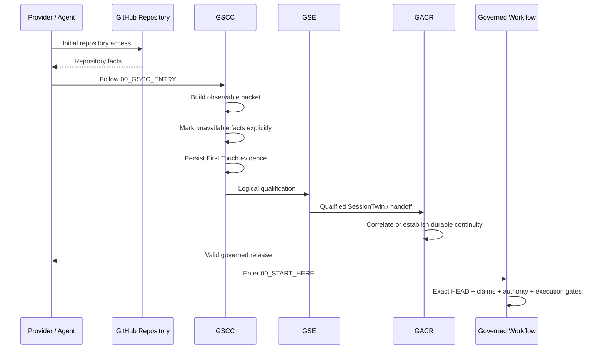

If the runtime does not expose a native provider conversation identifier, the correct value is `UNAVAILABLE`. The system must not synthesize one from the GitHub actor, repository name, branch, commit SHA or URL.

---

## 13. Repository hierarchy

A conceptual map of the most important public surfaces:

```text
Governed-Repository-Template/
│
├── 00_GSCC_ENTRY.md
│   └── mandatory pre-entry authority
│
├── 00_START_HERE.md
│   └── normal governed-work entry after valid release
│
├── GOVERNANCE.md
├── AGENTS.md
├── SOURCE_OF_TRUTH.md
├── PROJECT_CONTEXT.md
├── STATUS.md
├── SUIVI.md
├── TODO.md
├── NEXT_ACTION.md
│
├── docs/
│   ├── PROJECT_OVERVIEW.md
│   ├── ARCHITECTURE.md
│   ├── AUTOMATION.md
│   ├── MULTI_AGENT_COORDINATION.md
│   ├── INFORMATION_INTAKE.md
│   ├── CONNECTION_INTENT.md
│   ├── ENTRY_ACTION_ROUTER.md
│   ├── GACR_AGENT_CONTINUITY_RELAY.md
│   ├── GACR_BRIDGE_CONTRACT.md
│   └── control-plane/
│       ├── CURRENT_STATE.md
│       ├── CANONICAL_ARCHITECTURE.md
│       ├── PROGRAM.md
│       ├── TASKS.md
│       ├── NEXT_ACTION.md
│       ├── DECISIONS_LOG.md
│       ├── SUIVI.md
│       ├── DATA_MODEL.md
│       └── AGENT_ACTIVITY_LOG.md
│
├── .governance/
│   ├── control-plane-state/
│   ├── control-plane-db/
│   ├── agent-relay/
│   └── machine-readable policies / routers / state
│
├── .github/
│   └── governed workflows and CI
│
└── scripts/
    └── deterministic governance and execution helpers
```

Not every file is an authority for every context. The mandatory entry and read-order rules determine which source applies first.

---

## 14. Source of truth hierarchy

The framework intentionally separates explanatory documentation from normative and current-state authorities.

A useful reading model is:

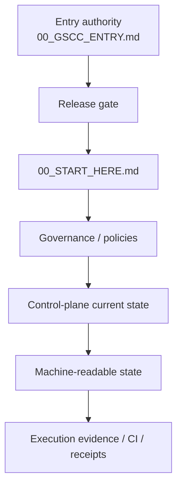

This `PROJECT_OVERVIEW.md` file is a **presentation and navigation document**. Where it conflicts with a normative authority or a machine-readable current-state contract, the canonical authority wins.

---

## 15. Current maturity model

The repository has evolved beyond a static template. Its major architectural layers now include:

```text
GOVERNED REPOSITORY PLATFORM
│
├── Admission & First Touch
│   └── GSCC
│
├── Logical qualification
│   └── GSE
│
├── Durable continuity
│   └── GACR
│
├── Central Governance Control Plane
│
├── Machine-readable governance state
│
├── Relational memory / SQLite projections
│
├── Governance Model Catalogue
│
├── Multi-agent coordination
│
├── Loop Engineering
│
├── Governed Execution Engine
│
├── GitHub integration
│
├── MCP capability integration boundary
│
└── Governed client repositories
```

Some capabilities may be structurally implemented and CI-tested before they are proven live across every external provider surface. Current-state authorities and checkpoints must be consulted for the exact maturity of any specific gate or integration.

---

## 16. How to read the repository

### If you are an arriving agent or automation

Do **not** start with this overview.

Start with:

1. `00_GSCC_ENTRY.md`
2. follow only the next authority emitted by that path;
3. enter `00_START_HERE.md` only after valid GSCC → GSE → GACR release.

### If you are a human discovering the project

Recommended conceptual path:

1. `README.md`
2. `docs/PROJECT_OVERVIEW.md`
3. `docs/control-plane/CANONICAL_ARCHITECTURE.md`
4. `docs/MULTI_AGENT_COORDINATION.md`
5. `docs/GACR_AGENT_CONTINUITY_RELAY.md`
6. `docs/control-plane/DATA_MODEL.md`
7. `docs/control-plane/CURRENT_STATE.md`

### If you need the current execution status

Read the source-only control-plane authorities, especially:

- `docs/control-plane/CURRENT_STATE.md`
- `docs/control-plane/PROGRAM.md`
- `docs/control-plane/TASKS.md`
- `docs/control-plane/NEXT_ACTION.md`
- `.governance/control-plane-state/checkpoint.json`
- `.governance/control-plane-state/handoff.json`

---

## 17. How to use the framework

The framework should be used as a **governed decision and execution path**, not as a collection of scripts to call independently.

The recommended operating model is:

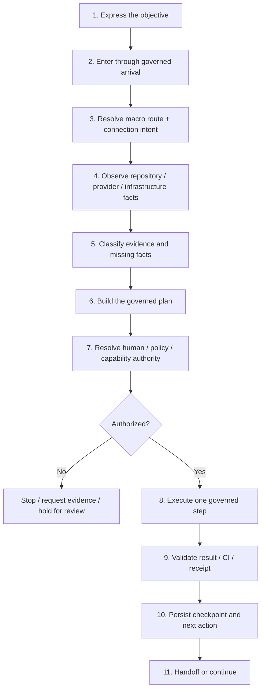

### 17.1 For a human project owner

A human owner normally uses the framework to state **what outcome is wanted**, answer only the decisions that cannot be derived from evidence, approve sensitive transitions where required, and inspect the resulting plan/evidence.

The owner should not need to manually reconstruct every repository fact before starting. The governance layer is intended to observe reusable facts first and ask questions only where a real choice, ambiguity or authority decision remains.

Typical owner interaction:

```text
OBJECTIVE
→ observed context
→ one unresolved decision at a time
→ proposed governed plan
→ explicit approval where required
→ execution evidence
→ final checkpoint / handoff
```

Examples of owner-level requests:

- "Create a new repository for this application."
- "Bring this existing repository under governance without breaking it."
- "Map this project before we decide how to modernize it."
- "Continue the work the previous agent stopped yesterday."
- "Prepare the deployment plan but do not touch production yet."
- "Let two agents work in parallel without colliding."
- "Record this new business requirement; do not code yet."

### 17.2 For an AI agent or assistant

An arriving agent must not select its own shortcut into the repository. It begins at `00_GSCC_ENTRY.md`, exposes only actually observable provider/runtime/tool context, follows the emitted gate sequence, and enters normal governed work only after release.

Once admitted, the agent should:

1. reobserve the canonical repository state;
2. load current checkpoint, tasks and handoff;
3. identify the currently authorized work item;
4. check dependencies and collision/claim state;
5. reobserve exact HEAD before mutation;
6. perform only the allowed scope;
7. validate through available tests/CI/evidence;
8. persist the result and next action;
9. leave a durable handoff if execution stops.

### 17.3 For automation, API clients and GitHub Apps

Automation follows the same authority model as conversational agents.

Being non-interactive does not waive:

- admission;
- evidence integrity;
- exact-HEAD verification;
- scope checks;
- authority gates;
- secret-handling rules;
- execution receipts;
- fail-closed behavior.

Where an expected provider fact is not exposed, automation records `UNAVAILABLE` rather than fabricating a substitute.

### 17.4 For the Central Governance Control Plane

The source repository can coordinate preparation across repositories. A governed request can be used to:

- identify the target repository;
- resolve whether the request is CREATE, ADOPT, MAP, LAB or CONTINUE;
- observe target facts;
- establish owner scope and authority;
- gather missing choices progressively;
- compile a chronological execution package;
- persist evidence;
- release a handoff into the target repository when ready.

The control plane prepares and governs the path; it does not automatically gain unrestricted authority over a target.

---

## 18. Use-case catalogue

The following catalogue describes the principal practical situations the framework is intended to support.

### UC-01 — Create a brand-new governed repository

**When to use it:** a project does not yet have its final repository and should start with governance from day one.

**Objective:** create the repository, establish its project baseline, collect required project/infrastructure intent, initialize durable state and produce a clean first-agent handoff.

**Governed route:** `CREATE_NEW_REPOSITORY`.

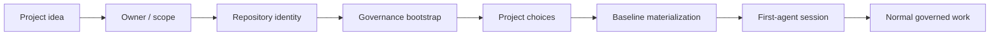

**Expected result:** a repository that has its own source of truth, governance state, baseline and resumable entry path.

**Important boundary:** repository creation does not automatically authorize server, DNS, database or production changes.

---

### UC-02 — Adopt an existing repository without destroying its history

**When to use it:** a real project already exists and must gain the governance framework.

**Objective:** add the governance structures while preserving application code, existing documentation and project history.

**Governed route:** `ADOPT_EXISTING_REPOSITORY`.

Typical sequence:

```text
READ EXISTING REPOSITORY
→ inventory current structure
→ identify conflicts
→ propose additive adoption
→ preserve project files
→ materialize governance
→ validate non-regression
→ establish governed baseline
```

**Expected result:** the existing project becomes governed without being treated as a blank template.

**Important boundary:** adoption is preservation-first. Existing files are not silently replaced merely because equivalent template files exist.

---

### UC-03 — Map and understand a project before modifying it

**When to use it:** architecture, dependencies, infrastructure or current implementation are not sufficiently understood.

**Objective:** build a factual current-state map and, where requested, a target architecture before any implementation decision.

**Governed route:** `MAP_EXISTING_PROJECT`.

Useful outputs can include:

- repository topology;
- application components;
- deployment surfaces;
- external dependencies;
- databases;
- infrastructure facts;
- current versus target architecture;
- technical debt or unknowns;
- capability gaps;
- evidence that requires human confirmation.

**Expected result:** a documented evidence-backed map.

**Default posture:** read-only. Mapping is not implicit permission to refactor.

---

### UC-04 — Develop or experiment safely in an isolated lab

**When to use it:** a change should be designed, prototyped or validated without mutating the canonical branch directly.

**Objective:** isolate evolution in a governed branch/PR, retain exact baseline evidence and validate before integration.

**Governed route:** `LAB_EVOLUTION`.

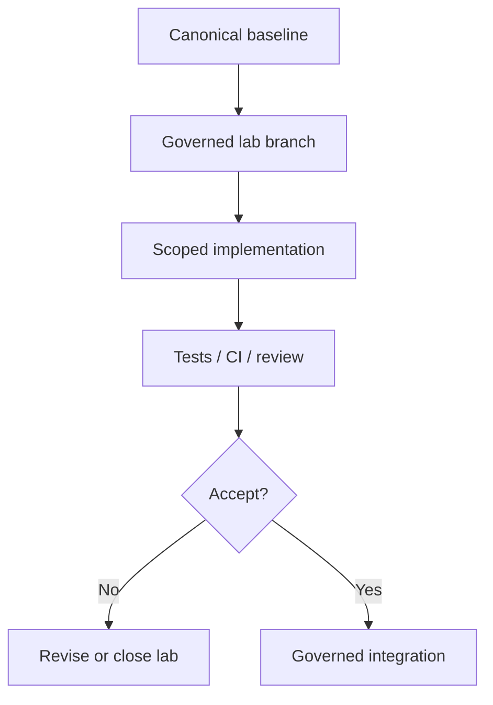

**Expected result:** an auditable experiment or implementation that can be reviewed without contaminating the canonical state.

---

### UC-05 — Continue a project from its exact point of stop

**When to use it:** work already exists and a new agent, new conversation or later session must resume it.

**Objective:** avoid restarting from memory, repeating completed work or acting on stale context.

**Governed route:** `CONTINUE_GOVERNED_WORK` plus GACR continuity.

The continuation should reconstruct:

- repository and canonical branch;
- observed HEAD;
- current work package/task;
- completed dependencies;
- active blockers;
- claims/collisions;
- relevant decisions;
- latest evidence;
- previous checkpoint;
- unique next action.

**Expected result:** continuation from durable state rather than conversational recollection.

---

### UC-06 — Hand work from one agent/conversation to another

**When to use it:** the original session ends, times out, reaches a limit or intentionally delegates.

**Objective:** preserve the exact stopping point and enough context for another governed arrival to resume safely.

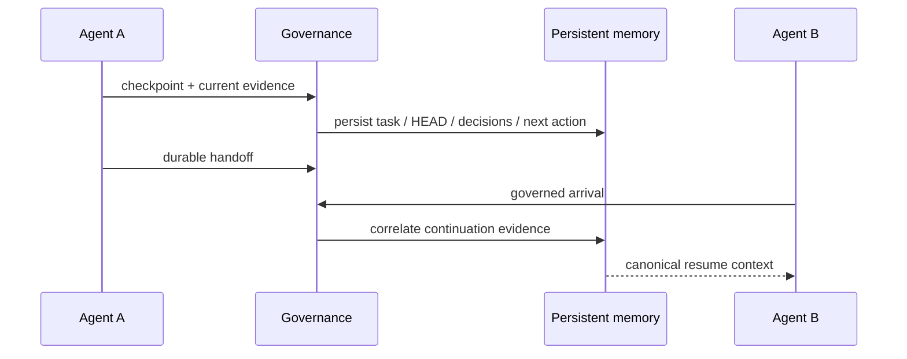

**Expected result:** Agent B does not have to infer where Agent A stopped.

**Important boundary:** a new conversation is not automatically declared identical to the previous conversation; correlation remains evidence-driven.

---

### UC-07 — Coordinate several agents working on the same project

**When to use it:** multiple agents, people or automations may work concurrently.

**Objective:** maximize parallelism while preventing incompatible writes and duplicated work.

Mechanisms include:

- namespaced work;
- claims;
- dependency ordering;
- exact-HEAD checks;
- collision detection;
- single-writer rules where required;
- durable task state;
- independent evidence and handoffs.

```text
PARALLEL THINKING / OBSERVATION
        allowed where safe
              │
              ▼
MUTABLE SURFACE
→ claim / dependency / exact-HEAD / authority
→ one compatible writer path
```

**Expected result:** parallel work without losing a single canonical project state.

---

### UC-08 — Intake new information without authorizing implementation

**When to use it:** the user, another system or an agent brings new facts, requirements, files, constraints or decisions.

**Objective:** persist and reconcile the information before turning it into implementation.

Information may be:

- accepted;
- linked to existing state;
- recognized as duplicate;
- classified as stale;
- found contradictory;
- held for review;
- routed into a future work item.

**Expected result:** knowledge can evolve independently of code execution.

**Important boundary:** `INFORMATION_INTAKE` and `CONTEXT_INTAKE` do not silently become mutation authority.

---

### UC-09 — Handle missing or unavailable provider identity

**When to use it:** ChatGPT, Claude, an API client or another provider does not expose an expected conversation/session/connection identifier.

**Objective:** keep the evidence model truthful.

Correct behavior:

```text
expected field not exposed
→ UNAVAILABLE
→ continue only if policy permits
→ never reconstruct from unrelated GitHub metadata
```

**Expected result:** admission and correlation remain based on facts rather than invented identity.

---

### UC-10 — Prepare infrastructure work without immediately changing infrastructure

**When to use it:** the project needs server, domain, DNS, TLS, directory, database, MCP, SSH or deployment preparation.

**Objective:** distinguish observed infrastructure, intended infrastructure and execution authority.

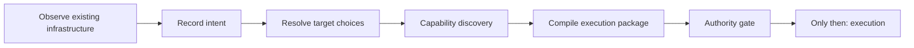

**Expected result:** a reproducible infrastructure plan with explicit unknowns, capabilities, dependencies and approvals.

**Important boundary:** choosing a server or domain is not itself permission to mutate that server or DNS zone.

---

### UC-11 — Use MCP capabilities safely

**When to use it:** the governed project can interact with external infrastructure through MCP.

**Objective:** bind execution only to capabilities that are currently observed, in scope and compatible with the required action.

The framework should verify:

- capability exists;
- tool contract matches;
- project/resource is in scope;
- credentials are available through approved mechanisms;
- mutation authority exists;
- target state is fresh enough;
- receipt can be produced safely.

**Expected result:** MCP becomes an execution transport under governance, not an authority source.

---

### UC-12 — Use GitHub as an execution surface

**When to use it:** repository operations such as branches, commits, pull requests, issues or Actions must be performed.

**Objective:** make GitHub mutations reproducible and attributable.

Typical governed checks:

```text
target repository
→ canonical branch
→ exact HEAD
→ allowed operation
→ work-item / claim
→ mutation
→ diff / CI / evidence
→ checkpoint
```

**Expected result:** GitHub work remains traceable and resumable.

---

### UC-13 — Recover from a failed workflow or partial execution

**When to use it:** CI fails, a transport is unavailable, an external dependency breaks or execution stops after partial progress.

**Objective:** diagnose from persisted evidence and resume without replaying successful or unsafe steps.

Recovery principles include:

- preserve failure evidence;
- distinguish retryable and non-retryable failure;
- reobserve state before retry;
- do not fabricate PASS;
- do not replay already attested successful operations unnecessarily;
- reopen the exact gate that needs correction;
- create a new corrective task if the defect is generic.

**Expected result:** deterministic recovery rather than blind rerun.

---

### UC-14 — Detect and handle contradictions

**When to use it:** new information conflicts with canonical state, previous evidence or another source.

**Objective:** prevent silent overwrites.

```text
NEW FACT
  + EXISTING CANONICAL FACT
            │
            ▼
       CONTRADICTION
            │
            ▼
      HOLD_FOR_REVIEW
            │
            ▼
 governed reconciliation
```

**Expected result:** contradiction becomes an explicit governance event.

---

### UC-15 — Upgrade governance across governed client repositories

**When to use it:** the framework evolves and clients need a compatible governance update.

**Objective:** distribute reusable governance improvements while preserving each client's mutable project state and source/client boundary.

**Expected result:** clients gain new governance capabilities without inheriting source-only control-plane history or resetting their own sessions, answers, baselines or project state.

---

### UC-16 — Maintain a durable project memory

**When to use it:** a project spans many days, agents, PRs, decisions and infrastructure activities.

**Objective:** make important state durable and queryable.

The durable memory model is intended to preserve relationships among:

- decisions;
- work packages;
- atomic tasks;
- evidence;
- questions/answers;
- dependencies;
- execution runs;
- artifacts;
- checkpoints;
- handoffs;
- external intakes.

**Expected result:** the repository becomes the durable operational memory instead of relying on one person's or one conversation's recollection.

---

### UC-17 — Prepare work now, execute later

**When to use it:** analysis and planning are authorized but mutation is not yet authorized.

**Objective:** allow useful progress without crossing the execution boundary.

The framework can progress through:

```text
observe
→ classify
→ map
→ ask missing questions
→ build plan
→ compile execution package
→ WAIT FOR AUTHORITY
```

**Expected result:** the project can become execution-ready while production/repository mutation remains blocked.

---

### UC-18 — Human approval as an explicit gate

**When to use it:** a decision is genuinely discretionary, irreversible, sensitive or outside previously delegated authority.

**Objective:** record the human choice as a governed decision rather than infer consent.

Examples:

- repository ownership or visibility;
- production server selection;
- destructive migration;
- sensitive infrastructure changes;
- approval of a prepared setup package;
- acceptance of an architectural direction.

**Expected result:** human agency remains visible and auditable.

---

### UC-19 — Audit what happened and why

**When to use it:** someone needs to reconstruct a prior action, failure, decision or handoff.

**Objective:** trace from current state back to evidence.

A useful audit chain is:

```text
CURRENT STATE
→ checkpoint
→ task/work package
→ decision
→ evidence
→ execution run
→ receipt / CI
→ source commit / PR
```

**Expected result:** an auditor or future agent can distinguish observed facts, human choices, inferred state and executed mutations.

---

### UC-20 — Operate the framework as a reusable governance platform

**When to use it:** multiple projects need a consistent governance model.

**Objective:** use the source repository as a reusable control plane while each project remains independently governed.

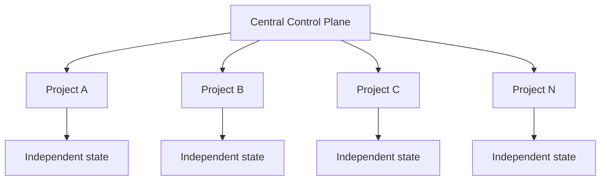

**Expected result:** common governance mechanics with isolated project truth.

---

## 19. Choosing the right route

A practical decision tree is:

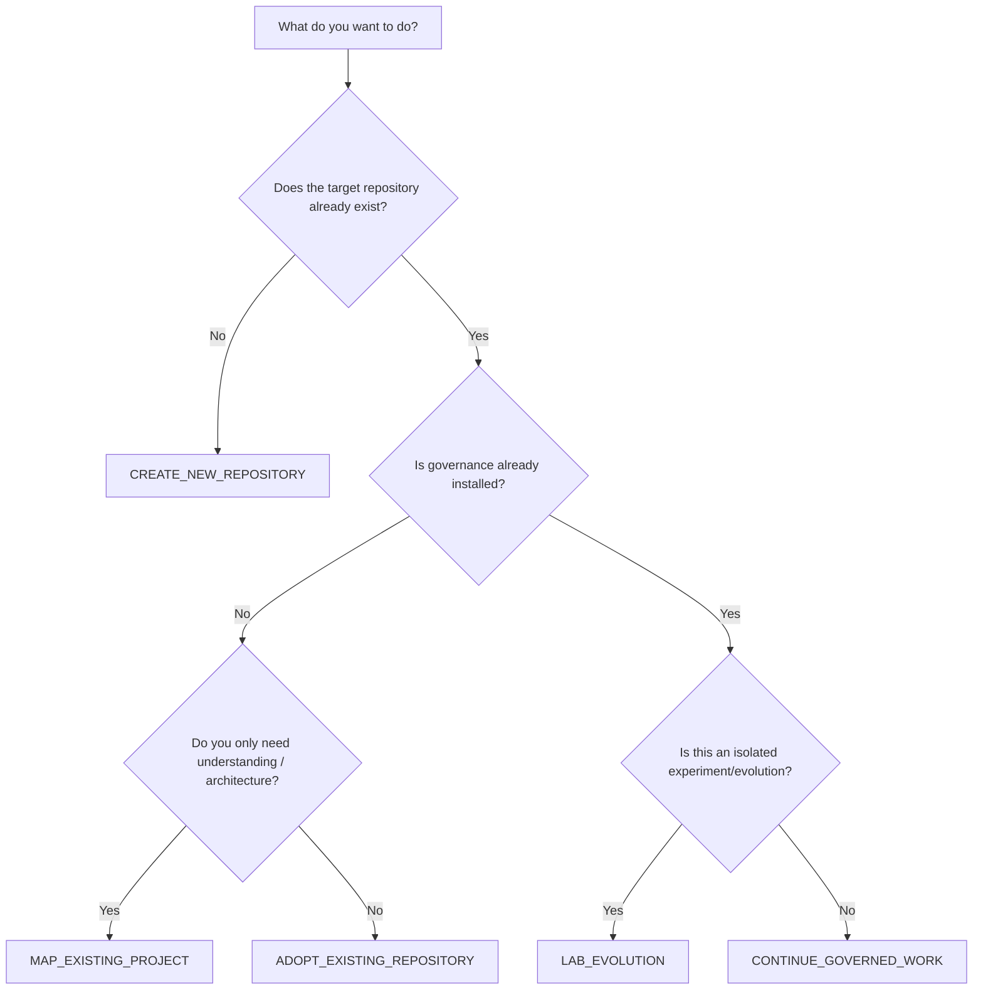

This selects the **macro route**, not mutation permission. Entry classification, intent, authority, capability and exact-state gates still apply afterward.

---

## 20. What the framework is not

The project is **not**:

- a mechanism for bypassing GitHub permissions;
- an authorization system that treats tool availability as consent;
- a replacement for application-specific architecture;
- a secret store;
- a guarantee that every provider exposes the same identity/session metadata;
- a reason to copy one project's history into another;
- a mandate to change production whenever infrastructure is discovered;
- a parallel task system that replaces the repository's canonical work state;
- a license for autonomous mutation without governed authority;
- a substitute for tests, CI, review or rollback planning.

It is a coordination, evidence, continuity and execution-governance framework around those systems.

---

## 21. Use-case outcome model

Across the different use cases, the intended pattern remains consistent:

```text
REQUEST
→ GOVERNED ARRIVAL
→ OBSERVATION
→ CLASSIFICATION
→ DECISION / AUTHORITY
→ PLAN
→ OPTIONAL EXECUTION
→ EVIDENCE
→ CHECKPOINT
→ HANDOFF / CONTINUATION
```

A valid outcome may therefore be:

- **executed successfully**;
- **prepared but awaiting approval**;
- **blocked by missing capability**;
- **blocked by contradictory evidence**;
- **read-only mapping completed**;
- **handoff ready**;
- **continuation correlated**;
- **fail-closed because identity/authority remains unresolved**.

A blocked outcome is not necessarily a failure of the framework. In a fail-closed governance model, refusing an unsafe or unsupported transition is often the correct result.

---

## 22. Core invariants

The project can be understood through a small set of invariants:

```text
Physical access != governed admission
Capability != authority
Intent != authorization
Provider data must not be invented
Ambiguous identity fails closed
GSE qualification precedes durable GACR binding
Exact HEAD precedes mutation
Persistent evidence precedes safe continuation
One repository's history must not leak into another
Control-plane memory != distributed client state
PASS evidence unlocks dependents
A blocked capability is not silently skipped
```

These invariants are more important than any individual implementation detail. They define the safety and continuity model the rest of the repository exists to enforce.

---

## 23. In one sentence

**Governed Repository Template turns repository access into a controlled, evidence-backed, persistent and resumable workflow so that humans and AI agents can collaborate across conversations, tools and repositories without losing state, inventing authority or silently bypassing governance.**
