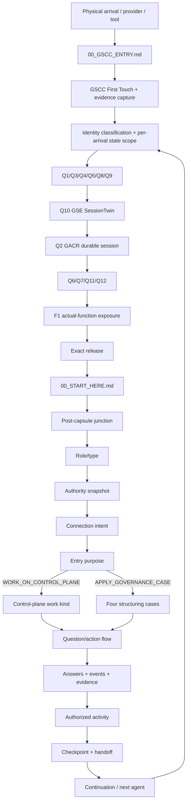

# MASTER SYSTEM MAP — Governed Repository Platform

> **Navigation / synthesis document — not a competing source of truth**
>
> This file is the single architectural map for humans and agents. It does not replace the canonical authorities it links to. When a detail conflicts with a named authority, the named authority wins.
>
> Current source repository: `chainsolutions-wealthtech/Governed-Repository-Template`

## 1. Why this map exists

The platform is intentionally split across several durable authorities: target architecture, current state, execution programme, questions/answers, continuity, GSCC/GSE/GACR runtime, routing policies and history.

This map provides one uninterrupted view so a new agent can answer five questions immediately:

1. **Where do I enter?**
2. **Which identity/session am I continuing?**
3. **What am I here to do?**
4. **What has already been answered/proven?**
5. **What is the unique next governed action?**

It must prevent two failure modes:

```text
FRAGMENTED DOCS → AGENT RECONSTRUCTS A DIFFERENT ARCHITECTURE
PARALLEL DOCS   → TWO AUTHORITIES COMPETE
```

The correct rule is:

```text
ONE MASTER MAP
→ links to existing authorities
→ shows their relationship and status
→ never silently supersedes them
```

## 2. Authority precedence

| Concern | Canonical authority |
|---|---|
| Target architecture / invariants | `docs/control-plane/CANONICAL_ARCHITECTURE.md` / `CP-ARCH-001` |
| Live current state | `docs/control-plane/CURRENT_STATE.md` + `.governance/control-plane-state/current.json` |
| Programme chronology | `docs/control-plane/PROGRAM.md` |
| Task graph | `docs/control-plane/TASKS.md` + `.governance/control-plane-state/tasks.json` |
| Unique next action | `docs/control-plane/NEXT_ACTION.md` |
| Decisions / supersession | `docs/control-plane/DECISIONS_LOG.md` |
| Chronological history | `docs/control-plane/SUIVI.md` |
| Questions / answers / events / checkpoints / handoffs | `docs/control-plane/DATA_MODEL.md` + `.governance/control-plane-db/*` |
| Pre-entry GSCC/GSE/GACR capsule | `00_GSCC_ENTRY.md`, GSCC/GSE/GACR runtime + `docs/control-plane/GSCC_GSE_GACR_REUSABLE_CAPSULE.md` |
| Entry action | `.governance/entry-action-policy.json` |
| Connection intent | `.governance/connection-intent-policy.json` |
| Source agent-purpose routing target | `.governance/control-plane-policy.json` + `RTE-001..RTE-012` |
| Continuity | checkpoint / handoff / GACR authorities |
| Namespace/work identity | `CP-NAMESPACE-001` |

## 3. End-to-end architecture



The final arrow is continuity, not a replay of First Touch. A continuation resumes the existing identity/session where exact/strong correlation permits it.

## 4. Identity and authority separation

These dimensions are never interchangeable:

```text
IDENTITY
!= ROLE
!= AUTHORITY
!= CONNECTION_INTENT
!= ENTRY_PURPOSE
!= WORK_KIND_OR_CASE
!= ENTRY_ACTION
!= MUTATION_AUTHORITY
```

### Current LIVE identity/session chain

```text
controlled arrival
→ gscc_arrival_ref / connection_ref
→ GSCC logical identity
→ GSE SessionTwin
→ canonical GACR session
→ Q12 grant evidence
→ F1 exposure receipt
→ release receipt
```

Status: **LIVE PROVEN** through final issue #244 / IDN-006.

Provider-private identifiers are supplied-only. Missing provider values stay `UNAVAILABLE`.

### Broader normalized identity model

The future relational/API model additionally wants explicit:

```text
PRINCIPAL
AGENT
CONNECTION
GOVERNED SESSION
ROLE
AUTHORITY SNAPSHOT
SESSION EVENTS
```

This is broader than the already-working GSCC/GSE/GACR runtime and remains part of the ARCH/GMC/API normalization roadmap.

## 5. Post-capsule junction

After exact F1-correlated release, the same arrival enters the global router.

```text
WHO / ROLE
  INTAKER | SUPERVISOR | CODE_AGENT | REVIEWER
↓
AUTHORITY SNAPSHOT
↓
CONNECTION INTENT
  OBSERVE | CONTEXT_INTAKE | INFORMATION_INTAKE
  | WORK_REQUEST | CODE_CHANGE | REVIEW | INFRASTRUCTURE
↓
ENTRY PURPOSE
  ├─ WORK_ON_CONTROL_PLANE
  │    ├─ CODE_IMPLEMENTATION
  │    ├─ EXECUTE_EXISTING_TASK
  │    └─ ADD_OR_ENRICH_INFORMATION
  └─ APPLY_GOVERNANCE_CASE
       ├─ CREATE_NEW_REPOSITORY
       ├─ ADOPT_EXISTING_REPOSITORY
       ├─ MAP_EXISTING_PROJECT
       └─ LAB_EVOLUTION
```

`CONTINUE_GOVERNED_WORK` remains a post-case entry action, not a fifth structuring case.

**Current status:** the two-stage `entry_purpose` router is documented and catalogued but remains `PLANNED_NOT_ACTIVE` until the RTE regression/activation gate passes. The existing entry-action and connection-intent policies remain the active routing contracts in the meantime.

## 6. Question / interaction / resume engine

The canonical relational model is the durable memory of governed interaction.

```text
framework case
→ phase
→ question
→ answer revision
→ event / evidence / decision
→ authorized activity
→ checkpoint
→ handoff
→ resume first unresolved applicable question/action
```

Primary tables:

- catalogue: `framework_cases`, `modes`, `case_phases`, `questions`, `question_options`, `activities`;
- execution: `runs`, `run_answers`, `decisions`, `run_events`, `evidence`;
- continuity: `checkpoints`, `handoffs`, `owner_feedback`, `agent_sessions`, `agent_activity_events`;
- pre-entry/runtime: First Touch, GSCC arrival, GSE SessionTwin and binding/runtime tables added by migrations 007–011.

Canonicality:

```text
Git-versioned authorities + SQL migrations + JSON seeds/events
→ deterministic materialization
→ SQLite validation projection
→ future PostgreSQL runtime
→ future Governance API / Admin UI
```

The SQLite binary never outranks Git authorities.

## 7. Four cases and continuation

| Path | Status | Meaning |
|---|---|---|
| CREATE_NEW_REPOSITORY | DONE / CASE1 closure validated | create + bootstrap + baseline + handoff + normal-entry proof |
| ADOPT_EXISTING_REPOSITORY | planned | additive adoption of an existing repository |
| MAP_EXISTING_PROJECT | planned | read-only current/target architecture mapping |
| LAB_EVOLUTION | planned | isolated branch/PR evolution |
| CONTINUE_GOVERNED_WORK | post-case mode | resume already governed work |

CASE 1 has the richest LIVE replay dataset today. The common Governance Model must be stabilized before the remaining cases are industrialized.

## 8. Current programme position

```text
P12-S1 DONE
P12-S2 DONE
P12-S3 DONE
P12-S4 DONE
P12-S5 DONE
P12-S6 DONE
      ↓
GMC-01 / GMC-G01 IN_PROGRESS  ← unique executable global task
```

CASE 1 is closed under CPD-073. GMC-A is released and GMC-01 / GMC-G01 is the current unique work package.

The closed IDN lane proved the capsule without bypassing this global ordering.

## 9. Downstream programme graph

```text
P12-S6 DONE
  ↓
GMC-01..GMC-19
  ↓
common governance model stabilized
  +
RTE-001..RTE-012 routing stabilized
  +
ARCH-006 cross-authority consistency
  +
IDN-006 LIVE capsule proof already DONE
  ↓
CAP-001..CAP-012
  ↓
reusable capsule 1.0.0
  ↓
API / PostgreSQL if justified / Admin UI
```

CAP does not duplicate GMC, RTE, ARCH or IDN. It packages their stabilized semantics.

## 9A. SaaS product / deployment target

The downstream product programme is `CP-SAAS-001` / `SAA-001..SAA-015`.

```text
validated governance semantics
+ reusable capsule 1.0.0
+ Governance API architecture
+ PostgreSQL projection architecture
+ identity/router API/UI contracts
+ admin cockpit architecture
        ↓
full backend REST/API + governed services
        ↓
full autonomous admin cockpit
        ↓
security / audit / observability
        ↓
reproducible staging
        ↓
production:
https://mcp.wealthtechinnovations.com/template
```

The cockpit must expose identity/session, GSCC/GSE/GACR, questions/answers, four cases, programmes/tasks/claims, evidence/decisions, checkpoints/handoffs, repositories/integrations, infrastructure/knowledge and deployment operations. Mutable controls must execute the same governance gates as non-UI workflows.

## 10. What is implemented, proven, planned and future

### LIVE PROVEN
- mandatory GSCC pre-entry;
- per-arrival identity/state isolation;
- First Touch vs continuation;
- Q9 correlated liveness;
- Q10 GSE before Q2 GACR;
- canonical GACR binding;
- Q6/Q7/Q11/Q12 qualification;
- F1 actual-function exposure;
- exact release to `00_START_HERE.md`;
- CASE 1 first-agent and later normal governed entry;
- second fresh CASE 1 E2E.

### IMPLEMENTED / ACTIVE FOUNDATION
- canonical SQL question/answer/event/checkpoint/handoff model;
- deterministic SQLite materialization;
- entry-action router;
- connection-intent policy;
- source-only programme/task/current/handoff authorities;
- GACR continuity/forensics/takeover surfaces;
- namespace/work collision guard.

### PLANNED / NOT ACTIVE
- two-stage `entry_purpose` router;
- full normalized principal/agent/connection/session/role/authority relational registry;
- GMC common model 1.0.0;
- remaining RTE/ARCH hardening;
- CAP productization;
- remaining three macro-case LIVE industrializations.

### FUTURE
- Governance API;
- PostgreSQL runtime projection if justified;
- Admin Web Application architecture/control surface;
- identity/router API/UI exposure;
- full SaaS platform implementation and production deployment under `CP-SAAS-001`.

## 11. How an agent must use the system

### Fresh physical arrival
1. read `00_GSCC_ENTRY.md`;
2. follow emitted authority only;
3. never equate repository readability with admission;
4. do not invent provider/session identity;
5. continue only after validated release.

### Released source/control-plane arrival
1. read this map;
2. read `CURRENT_STATE.md`;
3. read `CANONICAL_ARCHITECTURE.md`;
4. read `PROGRAM.md`, `TASKS.md`, `NEXT_ACTION.md`;
5. read relevant decision/history/data authorities;
6. reobserve exact HEAD before mutable work;
7. execute only the unique dependency-safe action.

### Continuation
1. resolve existing arrival/session;
2. load answers/events/evidence/checkpoint/handoff;
3. do not replay resolved questions;
4. resume the first unresolved applicable question/action;
5. reconcile exact HEAD before write.

## 12. Non-regression / no-destruction contract

Every extension must follow:

```text
PRESERVE
→ REUSE
→ CONNECT
→ EXTEND
→ MIGRATE COMPATIBLY
→ HOLD_FOR_REVIEW when safety cannot be proven
```

Forbidden:
- parallel source of truth;
- target-specific patch hiding a framework defect;
- silent answer/history deletion;
- recreated First Touch/GACR session for an existing correlated arrival;
- role/intent treated as mutation authority;
- silent activation of a PLANNED router;
- skipping programme dependencies;
- writing from stale HEAD.

## 13. Validation map

| Surface | Validation |
|---|---|
| GSCC/GSE/GACR | dedicated CI tests + LIVE issue/run evidence |
| question/answer model | materializer + schema validation |
| task graph | namespace/work registry + CI |
| current/next/handoff | bootstrap consistency + textual integrity |
| CASE 1 | pilot + second fresh E2E |
| RTE | future router regression matrix |
| CAP | future second-repository + second-adapter LIVE proof |
| API/UI | future, after semantics stabilize |

## 14. Read-next links

- Requirements / status / roadmap: `docs/control-plane/REQUIREMENTS_ROADMAP.md`
- Target architecture: `docs/control-plane/CANONICAL_ARCHITECTURE.md`
- Data/interaction model: `docs/control-plane/DATA_MODEL.md`
- Current state: `docs/control-plane/CURRENT_STATE.md`
- Programme: `docs/control-plane/PROGRAM.md`
- Tasks: `docs/control-plane/TASKS.md`
- Unique next action: `docs/control-plane/NEXT_ACTION.md`
- Capsule: `docs/control-plane/GSCC_GSE_GACR_REUSABLE_CAPSULE.md`
- Agent role/capacity prompts: `docs/control-plane/AGENT_ENTRY_PROMPTS.md`
